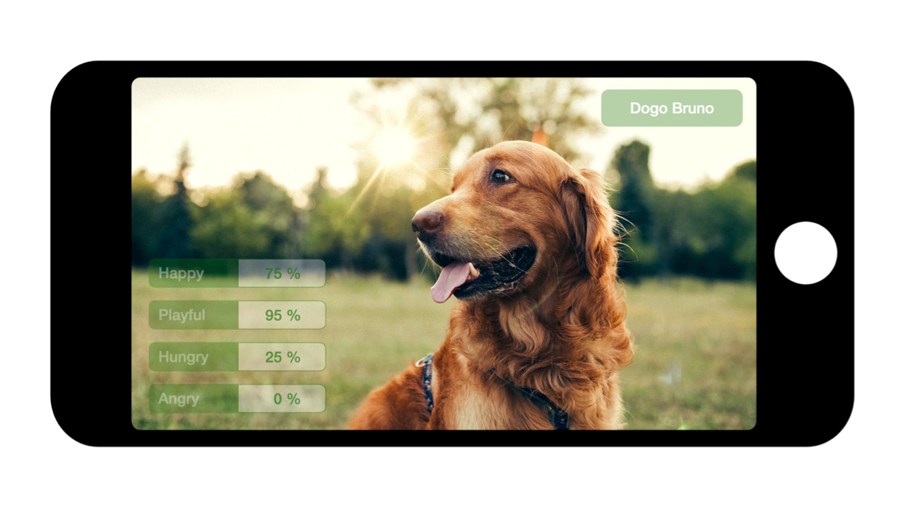

_Our perfect companions never have fewer than four feet - Colette 1853 - 1974._ 

But how do we know what our best friend is saying? Dogs express a very rich set of emotions. Happiness,
anger, hunger, jealosy, pain and practically every emotion humans exhibit. But they don't have words to express.
So they gesture. Head, ears, eyes, nose and tail - they speak volumes.

## Goal

- Build a mobile app (iOS and Android) that can live-track your dog's movements via the camera.
- Provide real-time, on-screen sentiments of your dog, e.g. happiness, hunger, anger, pain etc.
- Start with a single dog breed - maybe Golden Retriever.

## How do we do it?

- Develop suitable algorithms to detect specific dog sentiments.
- Learn from a tagged dataset of dog images by breed.
- Consider a mixture of appropriate technologies. Will decide as we proceed.

## Trademarks and licenses

The source code of Bow-Wow is licensed under [Apache License 2.0](https://www.apache.org/licenses/LICENSE-2.0)

## Contributing
See [CONTRIBUTING.md](CONTRIBUTING.md) file.
